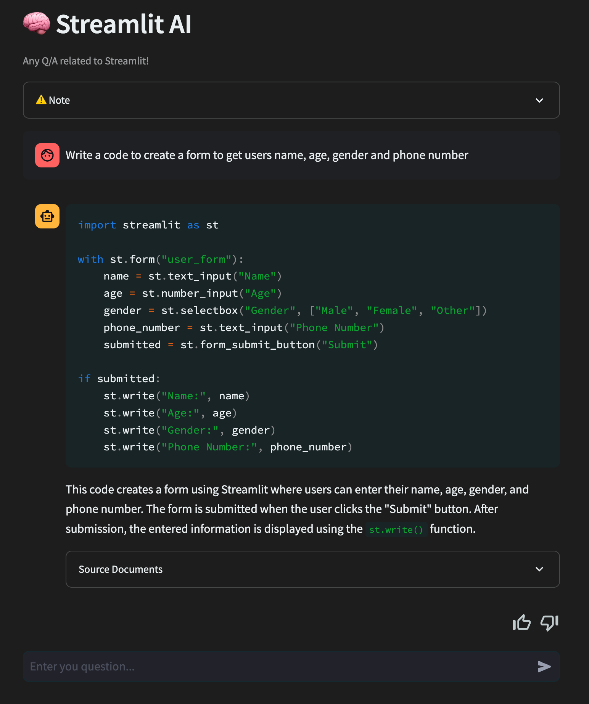

# GitDoc AI 📚

> Created the GitDoc AI app to improve knowledge retrieval and support from documentation. Users can effortlessly engage with their chosen documentation or GitHub repositories through a Language Model (LLM).

## Demo 
- [Demo video](https://github.com/SSK-14/GitDoc-AI/blob/main/assets/gitdoc-demo.mp4)
<div  style={{ display: 'flex' }}>


</div>


## Key Features 💡
- 📖 **Rich Documentation Access:** Instantly access project documentation, READMEs, code snippets, and more.
- 🌟 **Interactive Chat:** Engage with GitDoc for info, questions, and code insights.
- 🧠 **AI-Powered Insights:** Intelligent code tips with advanced Language Models.
- 🚀 **Boost Your Development:** Speed up coding, troubleshoot, and stay updated.
- 🌈 **User-Friendly Interface:** Enjoy a smooth coding experience.

Experience the future of GitHub documentation exploration with GitDoc - Where curiosity meets code! 🚀📚💬

## Requirements ✅

- Python 3.7 or above
- Langchain library
- Streamlit library

## To run the app ⚙️

#### Clone the repo

```
git clone https://github.com/SSK-14/Cloud-Guardian.git
```

#### If running for the first time,

1. Create virtual environment

   ```
   pip3 install env
   python3 -m venv env
   source env/bin/activate
   ```

2. Install required libraries

   ```
   pip3 install -r requirements.txt
   ```

#### Activate your virtual environment

```
source env/bin/activate
```

#### Run the Streamlit app

```
streamlit run 🏠_Home.py
```

## Resources 🔧

- [langchain](https://python.langchain.com/en/latest/index.html)
- [Streamlit](https://discuss.streamlit.io/)
