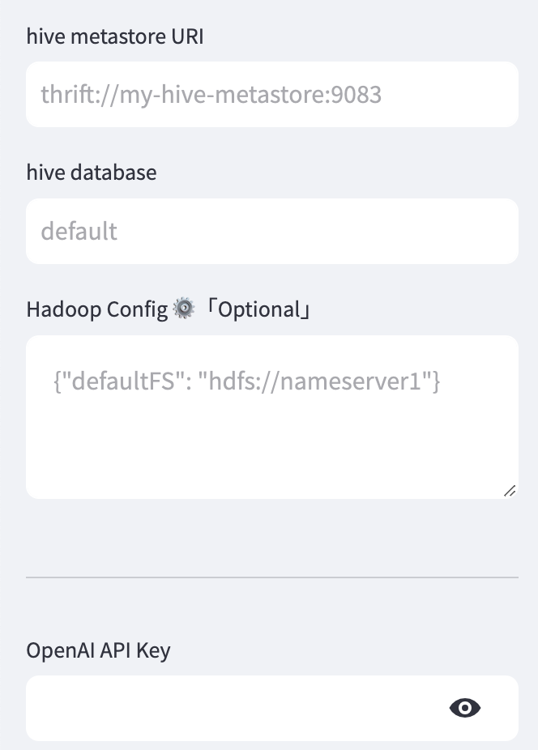
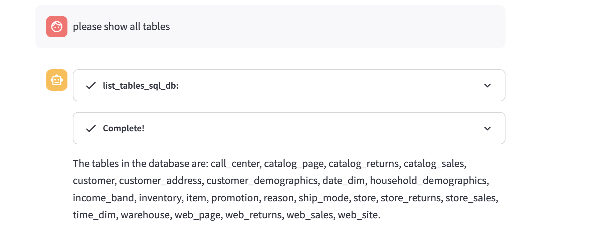
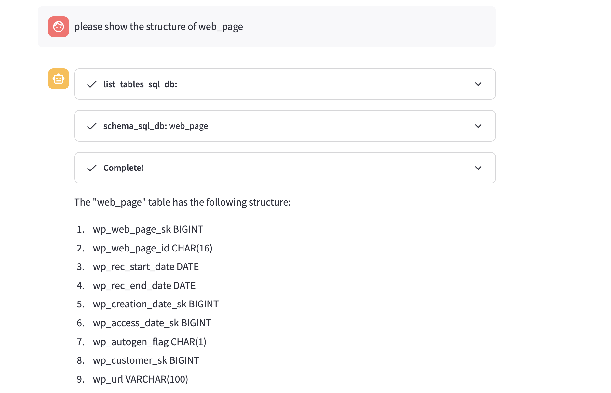
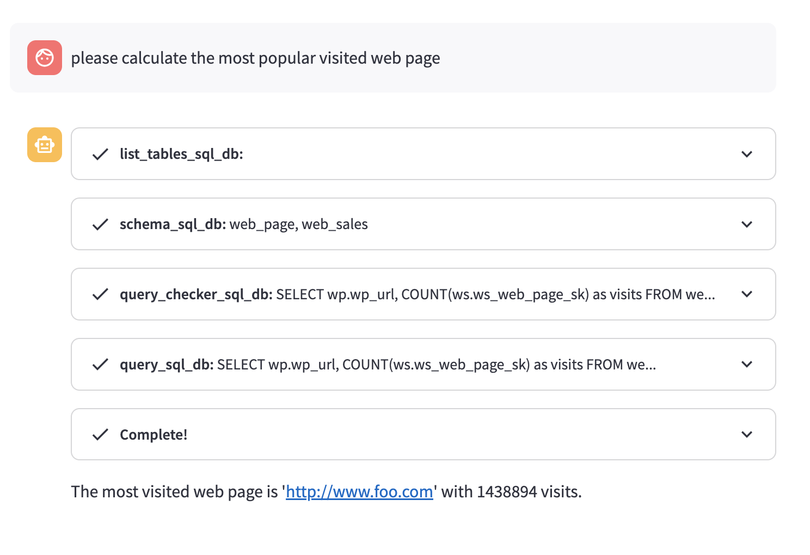

# Spark-AI-Assiant

Less than 100 lines of code, build your Spark chat application.


## Quick Start


```shell
pip3 install -r requirements.txt
streamlit run base.py
```

Configure Hive settings if you need to write data (please configure Hadoop config).





## 示例

1. View tables 

2. Get table structure


   

3. Calculate the hottest accessed pages

   