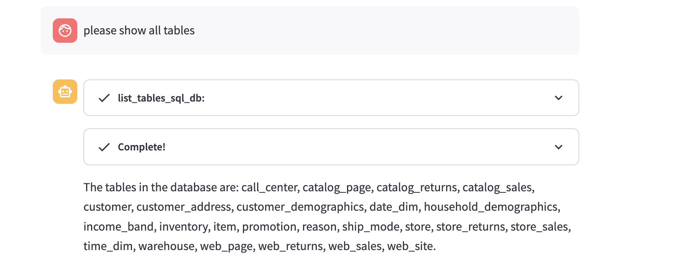
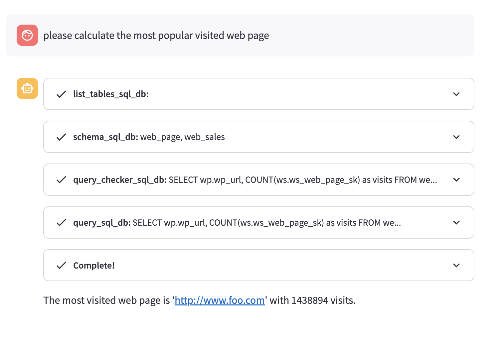

# Spark-AI-Assiant

[English Docs](https://github.com/mggger/SparkSQL-AI-Assiant/blob/main/README-en.md)

不到100行代码，构建你的spark聊天应用


## 快速开始

```shell
pip3 install -r requirements.txt
streamlit run base.py
```


设置hive配置信息， 如果需要写入数据的话(请配置hadoop config)


## 示例

1. 查看表

2. 获取表结构

   

3. 计算最热的访问页面

   