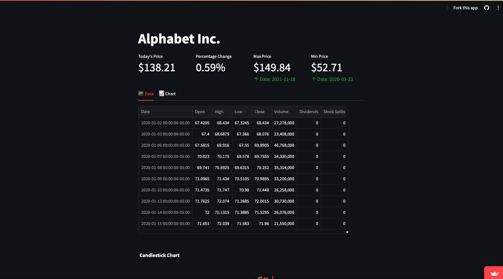

# StockAnalyzer

StockAnalyzer is a web application for analyzing and visualizing stock market data using Streamlit and Python. This tool provides various features to help you explore stock prices, financials, and more.

## Features

- **Stock Price Analysis:** Visualize historical stock prices, including open, close, high, and low, as candlestick and line charts.
- **Financial Data:** Access quarterly financials and cashflow data for a selected stock.
- **Stock Actions:** View stock actions such as dividends and stock splits.
- **Chatbot Integration:** Interact with a chatbot to get insights and information about the stock market.

## Getting Started

1. Clone this repository to your local machine.
   ```bash
   git clone https://github.com/your-username/StockAnalyzer.git
   ```

2. Install the required Python packages.
   ```bash
   pip install -r requirements.txt
   ```

3. Run the Streamlit app.
   ```bash
   streamlit run streamlit_app.py
   ```

4. Access the app in your web browser at `http://localhost:8501`.

## Usage

- Enter a valid stock ticker in the sidebar and click the "Search" button to load stock data.
- Use the chatbot to ask questions and analyze stock prices.
- Explore the various charts and financial data presented in the app.

[](resources/demo.mp4)
## Contributing

Contributions are welcome! Feel free to open issues or submit pull requests to help improve StockAnalyzer.


## Acknowledgments

- [Streamlit](https://streamlit.io/) - The web app framework used.
- [Yahoo Finance](https://pypi.org/project/yfinance/) - Data source for stock market data.
- [OpenAI](https://beta.openai.com/) - Chatbot integration using OpenAI's GPT-3.


