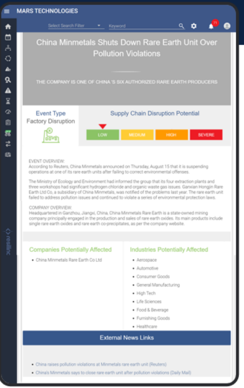

# Todo

- [ ] Webscraping portion to extract image from the article ( Image url )
- [ ] LLM Geo-Location tool extract 4 point coordinates from News Article
- [ ] Location plotting on map using 4 point coordinates ( What is the best way to do this? )
- [ ] Map Disruption Event to top 5 cloest suppliers and display 
- [ ] Get Severity data from Disruption event
  - [ ] Each Disruption event severity key? 
    * Do we want to hard code define? or let LLM define?
  - [ ] What do we want to do with the severity in the first place?

## Future Advanced todo

- [ ] Cross Reference different news sources for same disruptionEvent
- [ ] Use "popularity" of news sources as a metric of severity of disruptionEvent
- [ ] Map of suppliers should be a circle with a number representing how many suppliers are in that area, only on zoom in should the circle break up into individual suppliers

## End Deliverables/Features

TODO 4th Sept 2023
- [ ] Configuring DisruptionEvent class for insertion of disruption event into database 
- [ ] Disruption Event Risk Ranking based on pure location to suppliers 
- [ ] Random* Component linkage to Supplier 
- [ ] Streamlit Page for URL -> Disruption Event info 
- [ ] Leaflet Map features 
- [ ] Powerpoint for presentation 