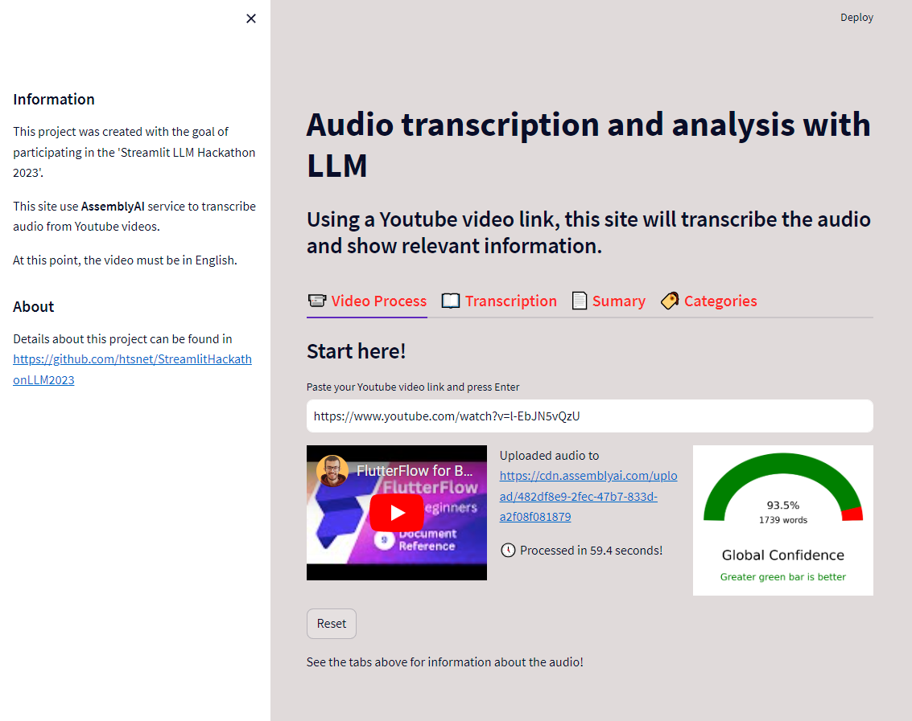
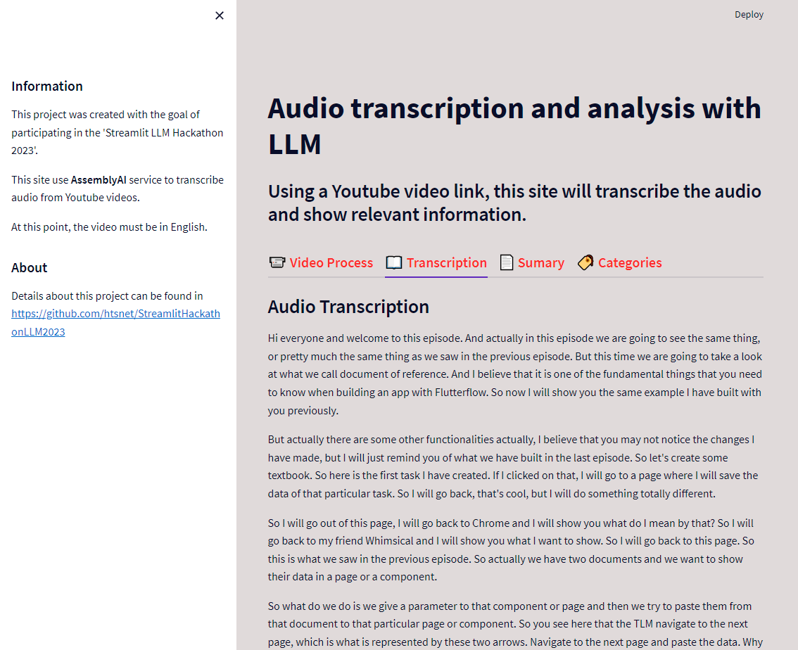
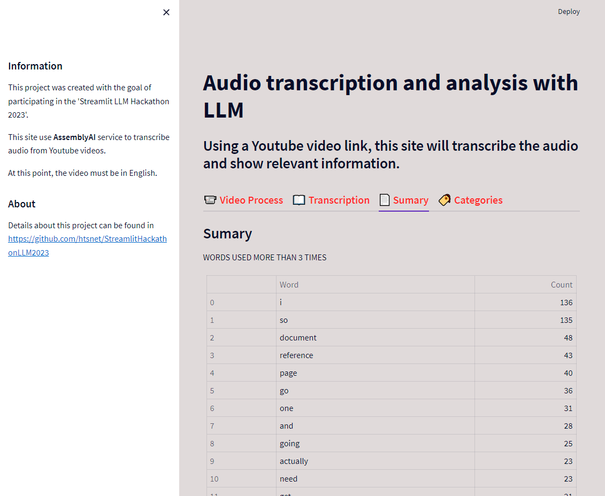
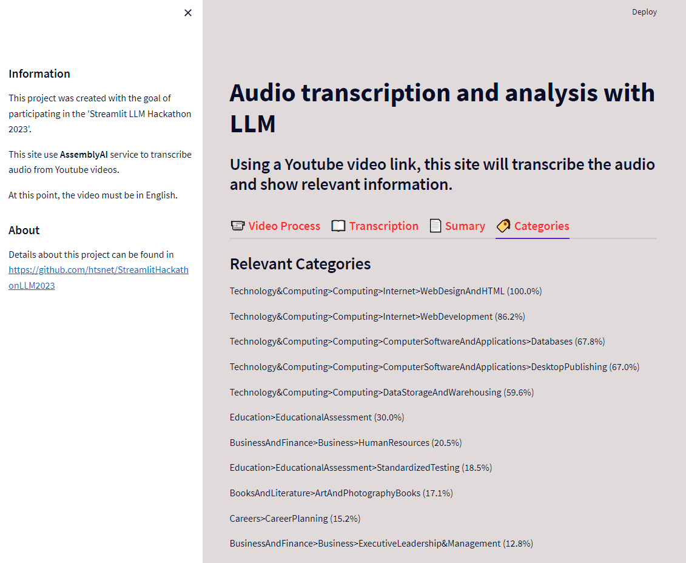
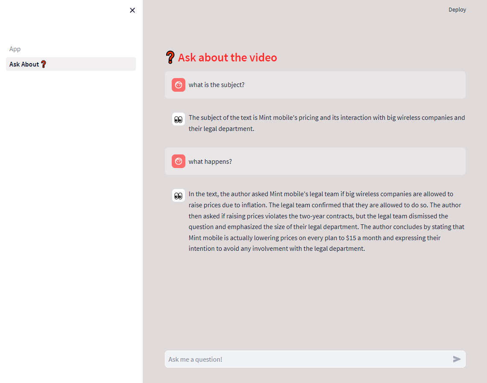

Project: Streamlit LLM Hackathon 2023  
Autor: Hamilton Tenório da Silva  
Date: Sep/16/2023  
Project name: LLM operations   
Description:
This project was created with the goal of participating in the 'Streamlit LLM Hackathon 2023'.   
This site uses AssemblyAI to transcribe audio from YouTube videos and LangChain to handle chat.
To chat about the video, please, supply your OPENAI API KEY.   
   
At this point, the video must be in English.   

See this project on https://apphackathonllm2023-rrqhordtnjzy9byshrqsu6.streamlit.app/

See a simple demo video on https://youtu.be/2Br9Yn3Ef2g   

   

   

   

   

------ Instructions ------   
pip install virtualenv  
python -m venv Ambiente_Virtual  
Ambiente_Virtual\Scripts\activate.bat
pip install <packages> (or pip install -r requirements.txt)   
streamlit run app_ai.py   
