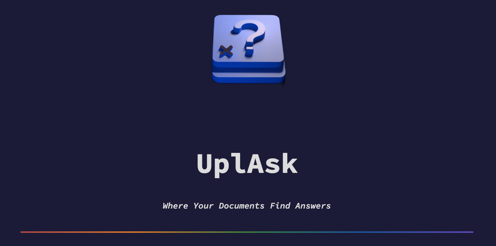

# UplAsk

## Disclaimer

:warning: Important: In this app you can upload document and ask question on it. The documents you upload will be analyzed using OpenAI's services. This means the content of your documents will be shared with OpenAI for processing. Please be cautious when uploading sensitive or confidential information.

## Overview

UplAsk is a Streamlit-based web application designed to automatically summarize and answer questions about uploaded PDF documents. This project is a side project for the **LLM Hackathon: Build innovative apps with leading LLML technologies!**



## How It Works

[Watch the video on Vimeo](https://vimeo.com/863237961/cf257b796a)

1. **API Key:** Enter your OpenAI API key to enable natural language processing features.
2. **Upload PDF:** Use the file uploader to submit a PDF document you wish to summarize or query.
3. **Wait for Processing:** The application will read and summarize the document, which may take a few seconds to a minute depending on the document length.
4. **Read Summary:** A concise summary will be provided for quick understanding.
5. **Ask Questions:** Use the chat interface to ask questions related to the document.

## Installation

1. Clone this repository.
2. Install required Python packages:  
    ```
    pip install -r requirements.txt
    ```
3. Run Streamlit app:  
    ```
    streamlit run app.py
    ```

## Requirements

- Streamlit
- PyPDF2
- Langchain
- openai

The required packages are listed in the `requirements.txt` file. You can install them all at once using `pip install -r requirements.txt`.

## License

This project is open source, under the terms of the [MIT License](./LICENSE).

## Acknowledgments

Special thanks to the LLM Hackathon organizers and everyone who has helped to improve this project.
