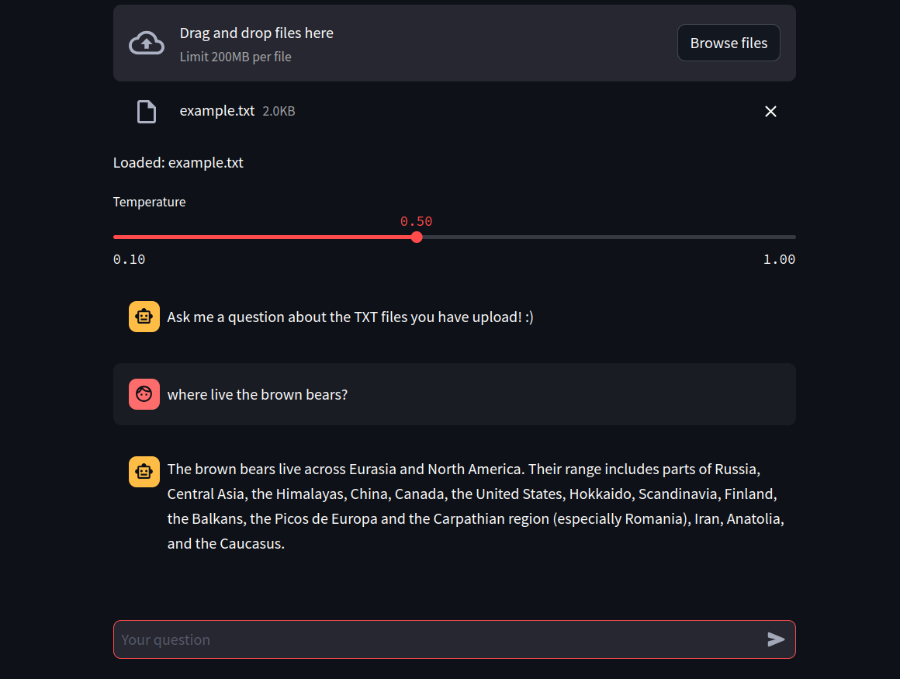

# ChatBot powered by 🦙📚 LlamaIndex
web to learn LLamaIndex:
    [Llama Index](https://gpt-index.readthedocs.io/en/latest/)
## Overview of the App

The OpenAI API incurs costs, and public websites that utilize it might exceed this limit. With this app, you can easily enter your personal API key and use it without web interruptions. Additionally, the main advantage is that you can choose the specific topic you want to inquire about—all you need is to have this information in text files, and you're good to go :)


- Use `st.slider` to select the temperature of the LLM
- Use `st.file_uploader` to load multiple files to make an index
- Takes user queries via Streamlit's `st.chat_input` and displays both user queries and model responses with `st.chat_message`
- Uses LlamaIndex to load and index data and create a chat engine that will retrieve context from that data to respond to each user query

## Demo App

You can provide the OPENAI_KEY via ".streamlit/secrets.toml"
 or entering as a `st.text_input`


## How to run it?

```
pipenv shell
streamlit run streamlit_app.py
```
or

```
pip install requirements.txt
streamlit run streamlit_app.py
```
[](https://llamaindex-chat.streamlit.app/)

## Get an OpenAI API key

You can get your own OpenAI API key by following the following instructions:
1. Go to https://platform.openai.com/account/api-keys.
2. Click on the `+ Create new secret key` button.
3. Next, enter an identifier name (optional) and click on the `Create secret key` button.
