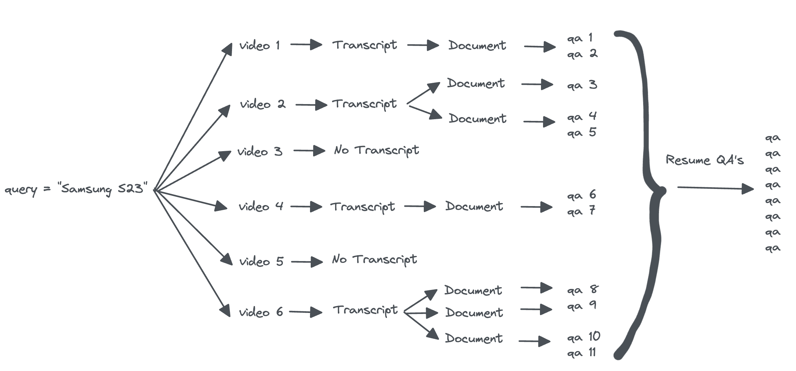

# social_listener

## The idea behind Question-Answer pairs generation

- If a transcript is too long it will be divided into multiple documents so it can be passed to the LLM.
- For each document we will generate one or more question-answer pair using the QAGenerationChain.
- After having the QA's of all the documents of all the video we will summarize the QA and remove the repeated ones. (Not implemented yet)



## Organisation of the repo

### Repository structure

```
├── bin                        <- Executable files, that could be main python scripts, or bash ones
├── config                     <- Configuration files whose values affect the workflow
│   └── config.toml            <- Schema of features tables
├── doc                        <- Documentation of this project
├── lib                        <- Main libraries used within the project
├── notebooks                  <- Notebooks made during the project
├── tests                      <- Unit tests
├── GUI                        <- Executable files of Dashboard app on streamlit
├── .gitignore
├── README.md
├── requirements.txt

```